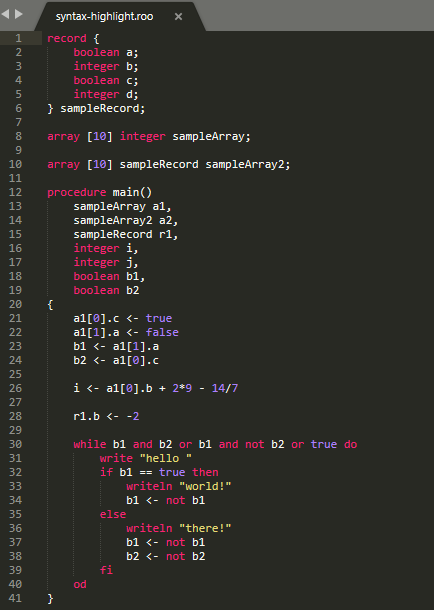

# Roo Syntax Highlighter for Sublime Text

The current implementation of this syntax highlighter is highly simplified, as it only highlights keywords (all identically), and is only slightly modified from the example sublime-syntax file.  
My hope is that a few modifications of this repository will allow more instructive syntax highlighting and provide a better experience when coding in Roo.  

  

## Installation Instructions
This syntax only works with Sublime Text, and installation is fairly easy:
1. Clone this repository, or download `roo.sublime-syntax`.
2. From the Sublime Text `Preferences` menu, select `Browse Packages` to open the packages folder
3. Copy `roo.sublime-syntax` to the `User` folder (create the `User` folder if it does not exist)
4. Create issues on my github repo if you find any!~
